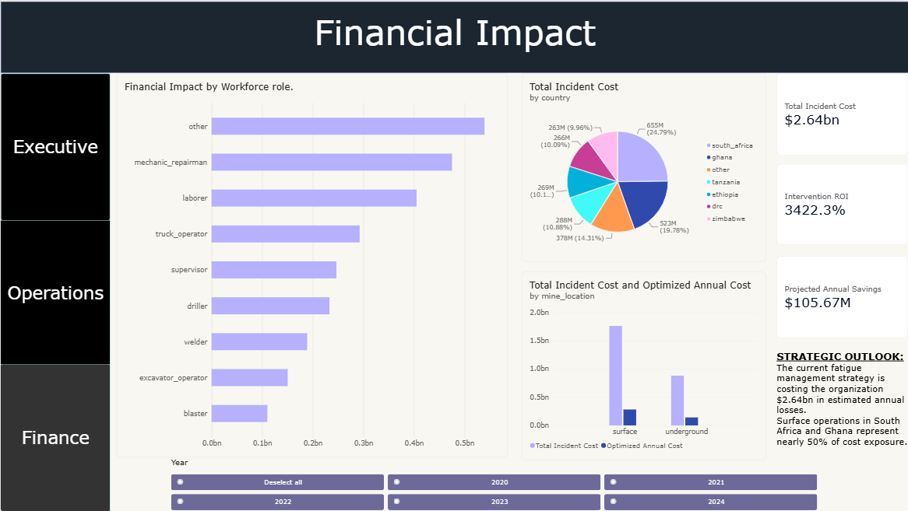
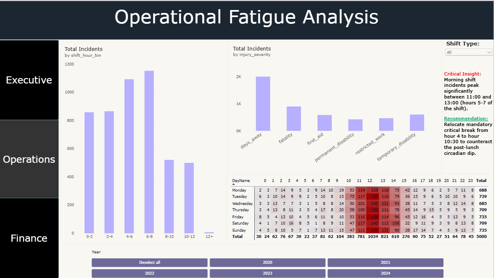
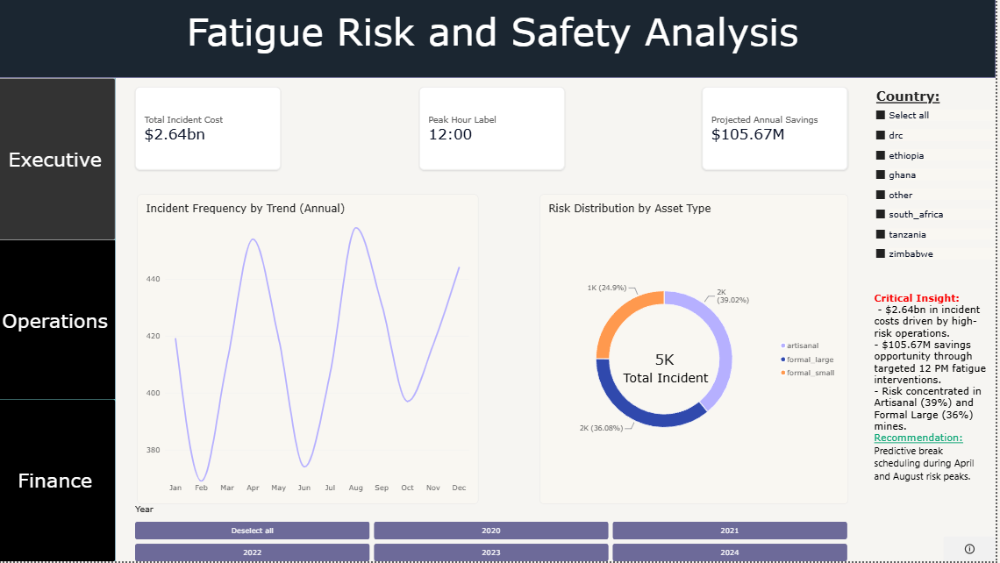

# When Breaks Matter Most
### A Data-Driven Look at Fatigue Risk in African Mining Operations

---

## The 4 AM Wake-up Call: Analysing Fatigue Risk in Mining Operations

My next-door neighbor spent twelve years working FIFO in the Pilbara, operating haul trucks on a two-weeks-on, one-week-off roster. He was experienced, highly regarded, and known for being careful behind the wheel.

A few months ago, I noticed he had not returned home for nearly a month. Since he lived alone, I grew concerned. When he finally came back, I asked about life on site and the challenges of working in mining.

One evening, he shared a story that stayed with me.

During a night shift, sometime around 4:00 AM, he was driving a fully loaded CAT 793 haul truck across the mine. Then something unsettling happened.

"I woke up," he said.
For the last twenty minutes. He couldn't remember the last corner he'd taken. He 
couldn't remember passing the fuel bay.

He pulled over. He sat there for ten minutes with his hands on the wheel, 
shaking. Then he finished his shift like nothing happened, because that's 
what you do.

He was lucky. The statistics say thousands of miners every year aren't.

---

## The Question

I wanted to know if there was a pattern to fatigue-related incidents in 
mining. Was the 4 AM window special? Could companies do something about it?

So I asked:

> **At what point in a shift, and at what time of day are mining 
> workers at highest risk of a safety incident? And where should 
> mandatory breaks be positioned to reduce that risk?**

---

## What I Found

I analysed 5,000+ mining incident records spanning 2020-2024 across 
operations in South Africa, Ghana, Tanzania, Zimbabwe, Ethiopia, and 
the DRC.

Three patterns stood out:

**1. Incidents peak at 12:00 noon, not 3 AM.**

This surprised me. The literature on circadian rhythms is unambiguous: 
the human body hits its lowest point between 3 AM and 5 AM. I expected 
to see that. Instead, the highest-risk hour was midday, with morning 
shift incidents clustering heavily between 11:00 and 13:00. This aligns 
with the well-documented "post-lunch dip", a secondary circadian low 
that occurs roughly 12 hours after the body's primary low point.

**2. Shift hour matters more than shift type.**

Regardless of shift, incident frequency climbed steadily through the 
first six hours and peaked between hours 6 and 8. Fatigue accumulates. 
The body doesn't care what the clock says if it's been working for 
seven hours straight.

**3. The pattern holds across countries and asset types.**

Both artisanal and formal mines showed the same distribution. The noon 
peak and the 6-8 hour peak appeared in every subgroup.

---

## The Financial Picture

Mining companies talk about safety like it's a value. And it is. But 
it's also a line item, and pretending otherwise doesn't help anyone.

I costed incidents by severity using established industry figures:

| Severity | Cost (USD) |
|----------|------------|
| Fatality | $2,000,000 |
| Permanent disability | $1,200,000 |
| Temporary disability | $250,000 |
| Days away | $80,000 |
| Restricted work | $20,000 |
| Minor / first aid | $5,000 |

**The results across the dataset:**

- Total incident cost (5-year): **$2.64B**
- Average annual cost: **~$528M**
- Projected savings at 20% reduction: **$105.67M per year**
- Estimated intervention cost: **$3M** (full program rollout)
- ROI: **$34.20 returned per $1 invested**
- Payback period: **~10 days**

Under Western Australia's Work Health and Safety (Mines) Regulations 
2022, Regulation 640 explicitly requires mine operators to manage 
fatigue risks. Breaches carry penalties up to $2.7M for a corporation, 
and industrial manslaughter carries a maximum fine of $10M with up to 
20 years imprisonment for individuals. Insurance against these 
penalties is unlawful.

---

## The Recommendation

> **Position mandatory critical breaks at the 5-hour mark for all 
> shifts, with a secondary micro-break at the 10-hour mark.**

Here's the logic:

- The peak risk window is hours 6-8
- Cognitive impairment accumulates before performance visibly degrades
- A break at hour 5 intervenes before the danger zone
- A micro-break at hour 10 prevents the post-lunch and end-of-shift 
  compounding effect

A conservative 15-20% reduction in fatigue-related incidents translates 
to over $100M in annual savings across the dataset. For a single site, 
the same framework applies at whatever scale is relevant to that 
operation.

---

## Important Caveats

I want to be transparent about the limitations of this work:

**1. The data is synthetic.**
This project uses the African Mining Safety Incidents Dataset, which 
was generated from published epidemiological parameters. It is not 
real operational data. The patterns are consistent with published 
literature, but they are illustrative, not definitive.

**2. The noon peak contradicted my hypothesis.**
I expected the 3-5 AM window. I found a noon peak instead. This doesn't 
mean the 3-5 AM window doesn't exist, it means this dataset captures 
the post-lunch dip more strongly. Real operational data would be needed 
to confirm either pattern.

**3. Correlation is not causation.**
Incidents cluster in specific windows. This doesn't prove fatigue caused 
them. Confounding factors like lighting, supervision, and task 
complexity all play a role.

**4. The financial figures are modelled estimates.**
The $2.64B total reflects the full synthetic dataset across multiple 
countries. For a single site, the annual cost would be substantially 
lower likely $5M-$30M depending on size. The percentage-based 
savings framework (20% reduction) is what transfers to real settings.

**5. This is a roster design tool, not a surveillance tool.**
The purpose is to help companies build better shift schedules, not 
to monitor individual workers. Fatigue is a systems problem. It 
should have a systems solution.

---

## How I Built It

**Data sources:**
- African Mining Safety Incidents Dataset (Hugging Face)
- Published fatigue cost data (National Safety Council, US DOT)
- WA WHS Regulations 2022 (penalty schedules)
- Circadian rhythm research (Dawson & Reid, 1997, and subsequent studies)

**Tools:**
- Python (pandas, numpy, matplotlib, seaborn) for analysis
- Jupyter notebooks for reproducible work
- Power BI for the interactive dashboard (DAX measures included)
- Git for version control

**Approach:**
1. Profiled and cleaned 5,000+ incident records
2. Engineered time-based features (hour of day, hours into shift, shift period)
3. Analysed temporal patterns with visualisations and summary statistics
4. Built a financial impact model using published cost data
5. Designed a Power BI dashboard with executive, operational, and financial views
6. Wrote this README to explain the why, not just the what

---

## Dashboard Overview

**Page 1: Financial Impact**
- Incident costs by workforce role
- Total incident cost by country
- Baseline vs. optimized annual cost
- ROI, projected savings, and strategic outlook

**Page 2: Operational Fatigue Analysis**
- Incidents by shift hour bin
- Incidents by injury severity
- Heatmap of incident density by day and hour
- Critical insight on the noon peak

**Page 3: Fatigue Risk and Safety Analysis**
- Incident frequency trend (annual)
- Risk distribution by asset type
- Country-level filters
- Strategic recommendations

## Dashboard Preview

### Financial Impact

### Operational Fatigue Analysis

### Fatigue Risk and Safety Analysis

---

